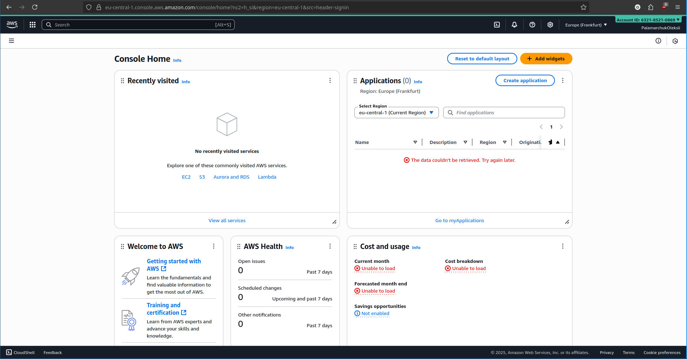
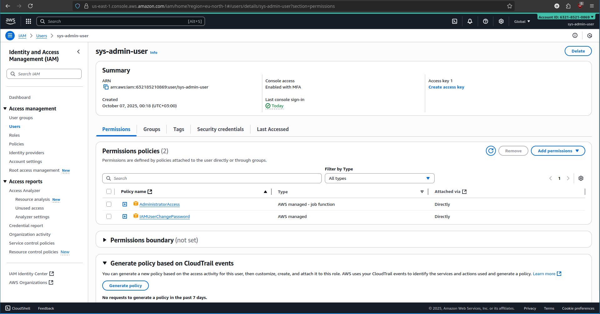
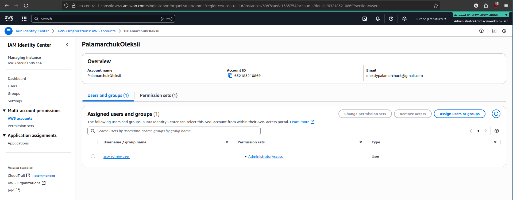

# 1. Set-up account. Register in a cloud provider. Now you have a root account.

## 1.a. Create an IaM user and attach FullAdmin policy. Use it for all future interactions with the system.  

## 1.b. Create an IaM Identity center account (or analog for you cloud provider). Also make it full admin.  

